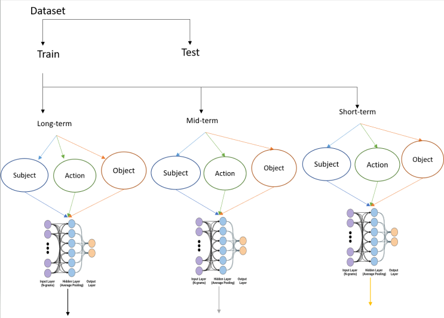
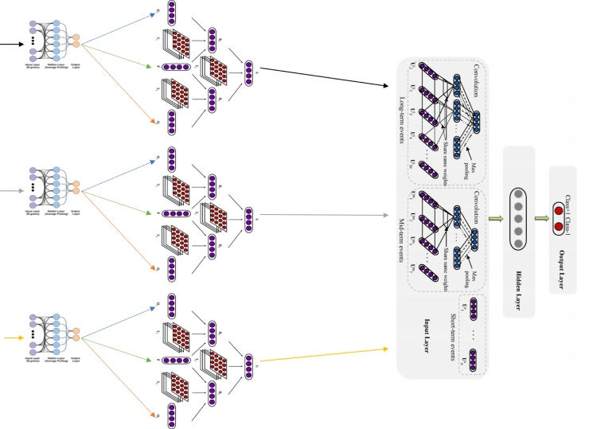
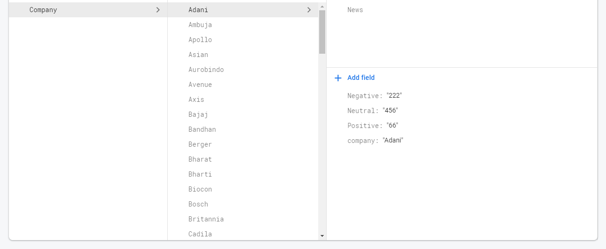
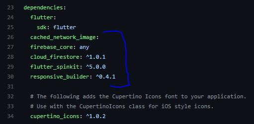
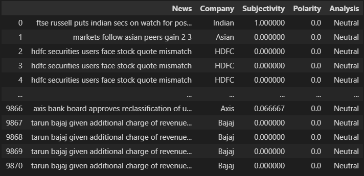
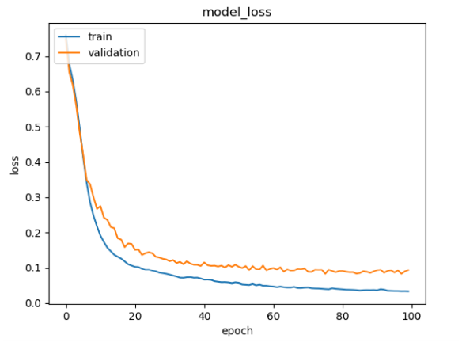

# Event-Driven-Stock-Market-Prediction 1.0

## Description

-  Project is all about a system that predicts stock prices using the events occurring day by day. Events have been extracted from the archives section of the newspapers            available online. Then the extracted headlines are been divided into three parts i. e. actor, relation, and object. After some preprocessing and generation of the word          vectors, these texts are sent for calculating entity relation representation to the novel neural tensor network. Further, they are processed using a deep convolutional neural    network with a max-pooling layer, and the result is been concluded into two classes positive and negative.

## Badges

 
 


## Visuals
1. Dataset --> Triplet Extraction --> Word-Embeddings(FastText model) 


   
   
2. Word-Embeddings --> NTN model --> convolutional model


   

## Setup

1. **Backend**

-  This repository contains Backend-side code for front-end and its installations process click [here](https://github.com/Spark-develop/Predictor.)

-  For setting up the backend, I had used [Google-Firebase](https://firebase.google.com/) on both the sides, pushing predicted Data of news and tweets to the firebase, using        [firebase admin] https://firebase.google.com/docs/database/admin/start#python package, the hyperlink contains setup documentation about the firebase admin and its queries.

-  If you are new you need to first Register/Sign up @ [Google-Firebase](https://firebase.google.com/) with email you want, go to console build a project and start.
   Follow the follwing structure and flow ofo database, for the code to work easily,
   

**Imports needed**
```
import firebase_admin
from firebase_admin import credentials
from firebase_admin import db
```

**Fetch the service account key JSON file contents**
```
cred = credentials.Certificate('path/to/serviceAccountKey.json')
```

**Initialize the app with a service account, granting admin privileges**
```
firebase_admin.initialize_app(cred, {
    'databaseURL': 'https://databaseName.firebaseio.com'
})
```

**As an admin, the app has access to read and write all data, regradless of Security Rules**
```
ref = db.reference('restricted_access/secret_document')
print(ref.get())
```
## Frameworks/Methods used
- Beautiful soup(bs4) - web scraping tool

-   -  Web-App development

-   -  Extracting twitter tweets using API.

-   -  gettings word vectors.

- NTN model for action - for getting entity relationship representation

- Convolution model - for training the representation and using it for predicting sentiments

2. **Frontend**

- The front-end is been posted into different repo, to visit click [here](https://github.com/Spark-develop/Predictor..git)

- Used flutter for development - flutter is a UI/UX framework for more details checkout few resources to get you started if this is your first Flutter project:

- [Lab: Write your first Flutter app](https://flutter.dev/docs/get-started/codelab)
- [Cookbook: Useful Flutter samples](https://flutter.dev/docs/cookbook)
- For help getting started with Flutter, view our [online documentation](https://flutter.dev/docs), which offers tutorials, samples, guidance on mobile development, and a full     API reference.

- for setting things up,
   1. Install flutter if not, using [this](https://flutter.dev/docs/get-started/install)
   2. After installation open the cmd prompt and type ```flutter create project-name```
   3. Copy the lib folder from the repo, [Predictor./lib/](https://github.com/Spark-develop/Predictor./tree/main/lib) to your new project and also import the dependencies from         [pubspec.yaml](https://github.com/Spark-develop/Predictor./blob/9c0de5ea4ccb9e56686b11815c0e83631714bfd8/pubspec.yaml)
      
      
      
   4. after copy pasting, to save dependencies run ```flutter pub get``` in the terminal, or click **Packages get** in IntelliJ or Android Studio.
  
 - For web deployment on flutter follow [this](https://flutter.dev/web) documentation
 - For connecting it to firebase console follow [this](https://flutter.dev/docs/development/data-and-backend/firebase)
 - Last but not the least, find out some awesome queries from [here](https://petercoding.com/firebase/2020/02/16/using-firebase-queries-in-flutter/).

 **for more details regarding flutter please contact me @ myiotproduct@gmail.com**
 
 do check my other Flutter projects,
 
 1. Connect apps - [EnginnerApp](https://github.com/Spark-develop/EngineerConnect.git)
                   [UserApp](https://github.com/Spark-develop/UserConnect.git)
                   [AdminApp](https://github.com/Spark-develop/adminapp.git)
                   
 2. [Grocery app](https://github.com/Spark-develop/grocery_app.git)

## Usage

- Firstly run [top_stocks.ipynb](topstocks.ipynb) file to get names of top stocks(Indian) which are established in BSE and NSE 
  ```
  link = "https://money.rediff.com/companies/market-capitalisation"
  dayres = requests.get(link)
  daysoup1 = bs4.BeautifulSoup(dayres.text, 'html.parser')
  ```
  the snippet in from the file, denoting that web scraping is been performed on the link given above.
- a new file will be created named [topL.csv](topL.csv), containing the web scraped names of top stocks.
  [topL](images/top_table_img.PNG)
  
- Further, execute the [extract_news.py](Utils/extract_news.py) for extracting the news of the top List.
- or run directly the [analysis.ipynb](analysis.ipynb) for processing the tweets for prediction.
- at last run the [predicted.ipynb](predicted.ipynb) for passing data to the firebase.(Please make changes in firebase_admin before running this file)

  
  
  

## Support

- [Sparx Develop](https://www.instagram.com/_sparxdev/)


- [Spark-develop](https://github.com/Spark-develop?tab=repositories)


- **Live demo @ [Predictor.](https://portfolios-work.web.app/#/)**


- Contact thorugh [email](mailto:myiotproduct@gmail.com)

## Road-map

- With the help of NTN and CNN, I had built 2 models Chronologically, where in the first model I had just used the raw embeddings for the sentiment analysis and after which for   more efficiency, I had converted the word embeddings into event embeddings using the fasttext model and NTN model.

- Just for the sake of displaying, I had craeted a prototype website containing the information of the predicted stocks.

- The comparison of word-embedding-based models and event-embedding-based models supports our previous assertion that events are better features for stock market prediction than   terms.

  

## Project Status

- I would be completing my garduation first, after which I would redesign the structure of the whole project and than pass it to the commuinty with many advances in my mind.

